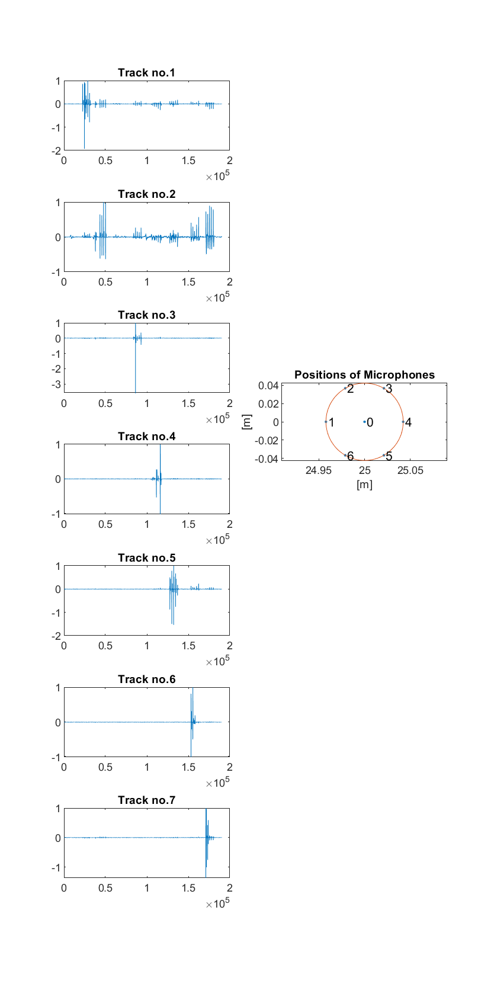

[//]: # (Title: Sound Localization using an UMA-8 Microphone Array
)
[//]: # (Author: Jose Maria Perez-Macias)
[//]: # (Tags: #sourcelocalization #spatialaudio #soundsourcelocalization #3Daudio)
[//]: # (Date: June 18, 2015)

# Project Advanced Audio Processing
Sound source Localization using an eigth-microphone Array (UMA-8 from MiniDSP)

## Functions
>test_positions.m \
`needs data/test_positions_mic_check_[0-2].m4a (or its matlab version).
plots the positions of the microphone and the test file.`
`The right positioning was found to be in test_positions_mic_check_2.m4a`

#### Figure 1. Plot of each of the microphones while being tapped sequentially.

---
### Methods
Methods used in this project are stored in /methods. They stem from _/ext_ but they are modified. srphat has been
modified to improve the performance significantly.
- /method_1: modified file is src/methods/method_1_classical/srpphat_jose_modified_1.m
- /method_2: uses an heuristic approach to reduce the time taken for the grid search using stochastic method.

### Main Scripts are
- method_1_2_estimate.m which creates the output for both methods.
- method_1_preliminarytest.m is testing the implementation of method_1 with my own audio sources and 
micrphone structure.

---
### Utils
Utils/ store some auxiliary functions, such as specific functions for the UMA-8. 
- Get microphone positions: they are obtained from the datasheet.
- Play the movie,
- and save the movie output. 
 - Also it has the export script to export from .m4a to .mat which has been done in Mac, 
   but it should "maybe" work in Linux as well. I do not know. Data was recorded using a Mac
   because recording is seamless and driverless using a Mac.

## External Libraries used in this project.
(These has been modified)

- _srplems.m_: from a Silverman article https://se.mathworks.com/matlabcentral/fileexchange/24352-acoustic-source-localization-using-srp-phat?focused=5125898&tab=function
- _srphat_jose_modified_1_: modified from  https://github.com/carabiasjulio/SourceLocalization

## Data description
described in _/src/data/data_description.txt_

## Video results
[Video result](https://homepages.tuni.fi/jose.perez-macias/sound_localization.html)

## Data Description
Data is described in src/data/data_description.txt

- car_macwebcam_video_3: recorded with MPP Retina 2015 and UMA8 @ 11khz
- car_macwebcam_video_2. recorded with a MBP2010 13inch and UMA8 @ 11khz

http://homepages.tuni.fi/jose.perez-macias/.avi
http://homepages.tuni.fi/jose.perez-macias/.avi
